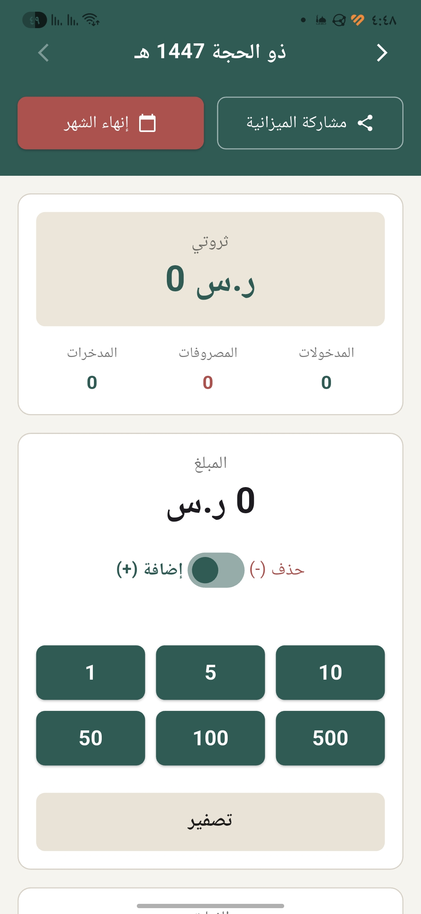
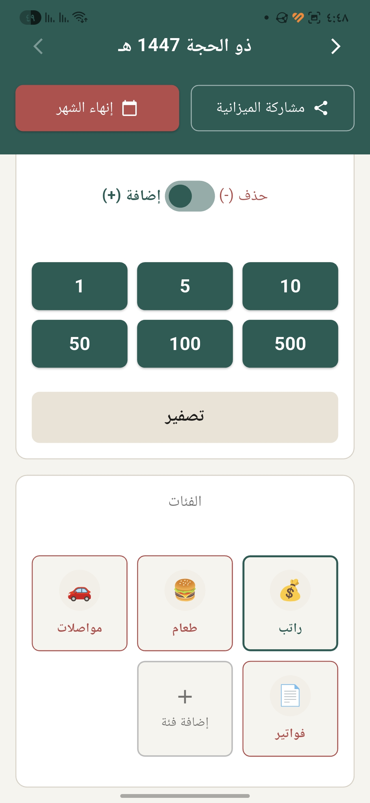

<div align="center">
  <h1>Wallet — Expense Tracker App | تطبيق تتبع المصاريف</h1>

  <p>
    <a href="https://flutter.dev"></a>
    <a href="https://BaselCS.github.io/flutter_wallet/"></a>
    <a href="https://github.com/BaselCS/flutter_wallet/releases"></a>
  </p>

  <h3>Choose Language / اختر اللغة</h3>
  <p>
    <a href="#english">English</a> | <a href="#العربية">العربية</a>
  </p>
  
  <br>

  <a href="https://BaselCS.github.io/flutter_wallet/">
    
  </a>
  &nbsp;&nbsp;&nbsp;&nbsp;
  <a href="https://BaselCS.github.io/flutter_wallet/">
    
  </a>

  <br><br>

  [](https://BaselCS.github.io/flutter_wallet/)

</div>

---

<h2 id="english">English</h2>

A lightweight and fast app for recording and tracking daily expenses with minimal effort, designed for single-handed use and mostly without the need for typing.

### Development Note
The purpose of this app was to experiment with designing and developing an application using AI agents. Therefore, the design and most of the code were generated by them:
- GitHub Copilot: Coding
- Figma AI: Design
- Gemini: Planning

### Download and Try the App
There is a ready-to-install release. You can download it as an **APK** for Android devices directly from the [Releases](../../releases) page in this repository.

### Core Features
* **Fast Input:** Enter amounts with just three taps.
* **Hijri Calendar Financial Management:** Track expenses and income based on Hijri months.
* **Actual Financial Status:** An instant summary showing your exact financial position (Previous Balance + Income - Expenses).
* **Data Export:** Ability to export all records in `CSV` format.
* **Smart Adjustment:** Correct financial errors via an add/subtract toggle without needing to navigate complex records.

### Tech Stack
* **Framework:** Flutter
* **State Management:** Provider
* **Local Database:** SQLite

### Installation and Running (For Developers)

1. Install dependencies:
```bash
flutter pub get
```

2. Run the app on an emulator or a connected device:
```bash
flutter run  
```

3. Build the release version (APK):
```bash
flutter build apk --release
```

### Privacy
The app works entirely offline. All data is stored on the user's device, and no information is sent to external servers.

### Contributing
Contributions are welcome, whether to improve the app, add new features, or fix bugs. Open an Issue or submit a Pull Request.

### License
This project is open-source under the [MIT License](https://www.google.com/search?q=LICENSE) — see the license file for more details.

---

<h2 id="العربية">العربية</h2>

تطبيق خفيف وسريع لتسجيل وتتبع المصاريف اليومية بأقل جهد، مصمم للاستخدام بيد واحدة وبدون الحاجة لكتابة في الغالب.

### ملاحظة حول التطوير 
كان الغرض من التطبيق تجربة تصيميم و تطوير تطبيق بوكلاء الذكاء الاصطناعي و عليه فالتصميم و جل الأكواد منشئة من خلالهم:
- Github Copilot : البرمجة 
- Figma AI : التصميم 
- Gemini  : التخطيط  

### تحميل وتجربة التطبيق
يوجد إصدار جاهز للتثبيت . يمكنك تحميله بصيغة **APK** لأجهزة أندرويد مباشرة من خلال صفحة [Releases](../../releases) في هذا المستودع.

### المميزات الأساسية
* **إدخال سريع:** إدخال المبالغ بثلاث لمسات. 
* **إدارة مالية بالتقويم الهجري:** تتبع المصاريف والدخول بناءً على الأشهر الهجرية .
* **الوضع المالي الفعلي:** خلاصة فورية توضح موقفك المالي بدقة (الرصيد السابق + الدخل - المصاريف).
* **تصدير البيانات:** إمكانية تصدير كافة السجلات بصيغة `CSV` .
* **تعديل ذكي:** تصحيح الأخطاء المالية عبر مفتاح الإضافة/الحذف دون الحاجة للرجوع لسجلات معقدة.

### الحزمة التقنيات
* **إطار العمل:** Flutter
* **إدارة الحالة (State Management):** Provider
* **قاعدة البيانات المحلية:** SQLite

### التثبيت والتشغيل (للمطوّرين)
1. تثبيت الاعتماديات:
```bash
flutter pub get
```

2. تشغيل التطبيق على محاكي أو جهاز متصل:
```bash
flutter run  
```  

3. بناء نسخة الإصدار (APK):
```bash
flutter build apk --release
```

### الخصوصية
التطبيق يعمل بالكامل دون اتصال بالإنترنت. تُخزن جميع البيانات على جهاز المستخدم ولا ترسل  أي معلومات إلى أي جهات خارجية ولا حتى تصلنا .

### المساهمة
المساهمات مرحب بها سواء كانت لتحسين البرنامج، إضافة ميزات جديدة، أو إصلاح أخطاء. افتح Issue أو أرسل Pull Request.

### الترخيص
هذا المشروع مفتوح المصدر تحت رخصة [MIT License](https://www.google.com/search?q=LICENSE) — راجع ملف الترخيص للمزيد من التفاصيل.
